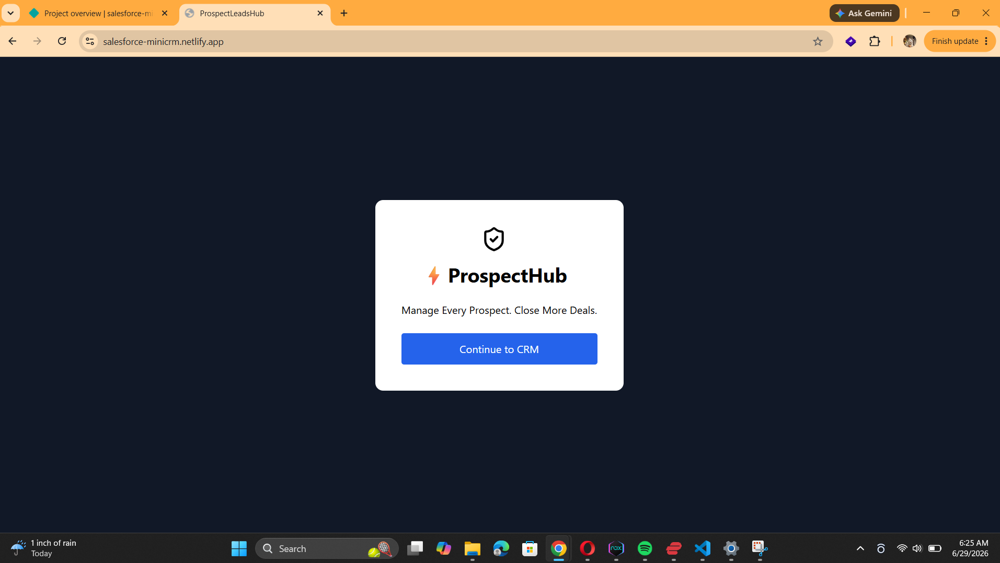
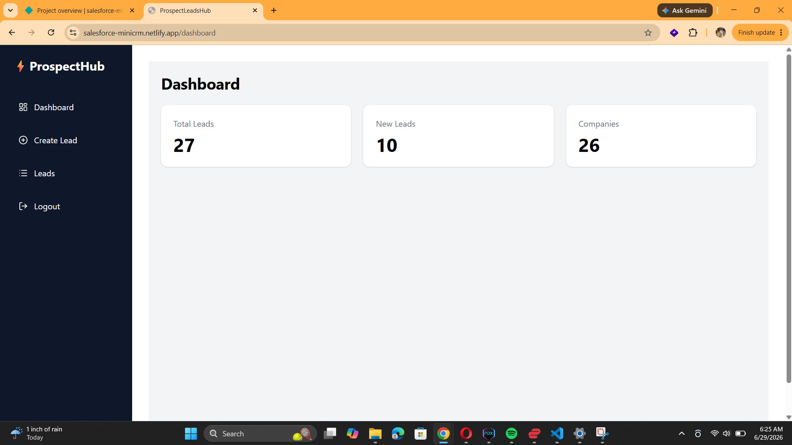
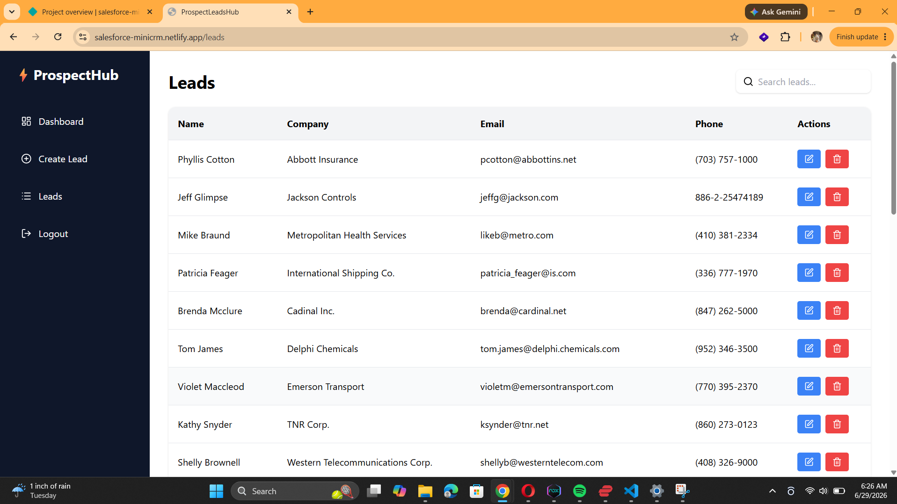
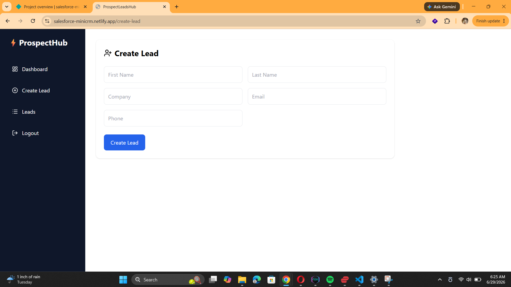

# ProspectHub CRM

A full-stack Customer Relationship Management (CRM) application integrated with Salesforce using the Salesforce REST API.

## Live Demo

Frontend: salesforce-minicrm.netlify.app

Backend API:  https://salesforce-integration-l793.onrender.com

## Overview

ProspectHub CRM helps users manage sales leads from a simple web interface while synchronizing data with Salesforce.

The application supports creating, viewing, updating and deleting leads directly from Salesforce through a modern React dashboard.

## Tech Stack

* React.js
* Node.js
* Express.js
* MongoDB
* Salesforce REST API
* Tailwind CSS
* Render
* Netlify

## Features

* Secure Salesforce authentication
* View all Salesforce Leads
* Create new Leads
* Update existing Leads
* Delete Leads
* Search Leads instantly
* Responsive dashboard for desktop and mobile
* MongoDB token persistence
* Production deployment

## Architecture

```text
React Frontend
        │
        ▼
Node.js + Express API
        │
        ▼
Salesforce REST API
        │
        ▼
Salesforce CRM
```

MongoDB is used to securely persist Salesforce authentication tokens.

## Skills Demonstrated

* REST API Integration
* Full-Stack Development
* Salesforce CRM Development
* OAuth Authentication
* MongoDB Integration
* Responsive UI Design
* CRUD Operations
* Production Deployment


## Screenshots

### Login Page



---

### Dashboard



---

### Leads Management



---

### Create Lead


